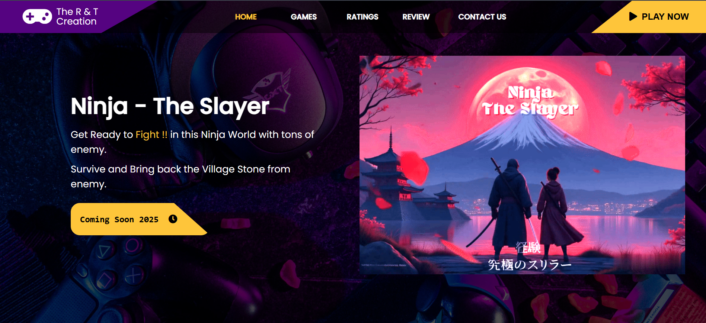
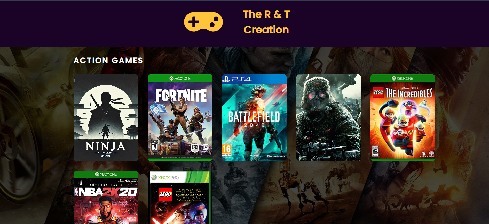
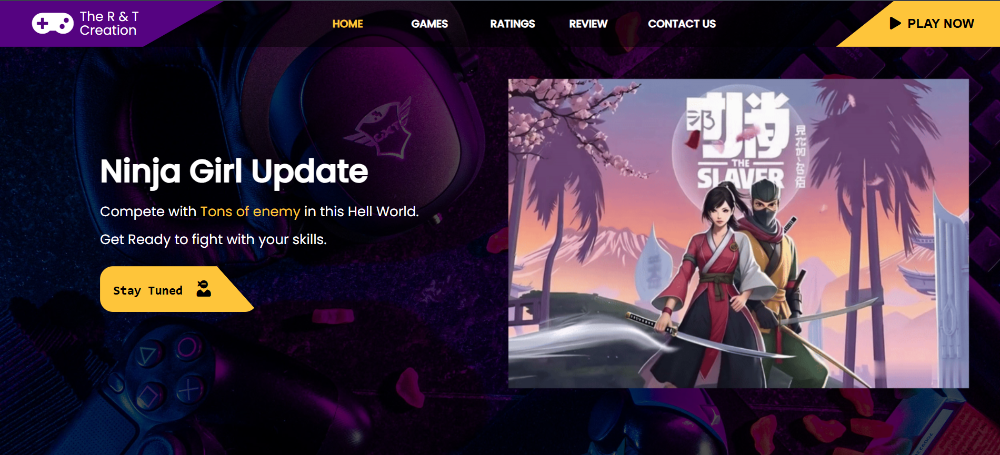

# 🥷 Ninja - The Slayer: Game Download Website

This is the official website for **Ninja - The Slayer**, a 2D Java-based desktop game.  
The website is built using **Django** for the backend and **HTML, CSS, JavaScript** for the frontend.  
Users can explore details about the game and **download the desktop version** directly from the website.

---

## 🌐 Website Features

- 🎮 Game showcase page with description and features
- 📥 Direct download link for the game (ZIP/EXE/JAR)
- 📱 Responsive UI built with HTML, CSS & JS
- ⚙️ Django-powered backend for future expansion (e.g., login, leaderboard, feedback form)

---

## 💻 Tech Stack

| Framework | Language | Styling   | Scripts |
|-----------|----------|-----------|---------|
| Django    | Python   | CSS       | JS      |
| HTML5     |          |           |         |

---

## 🖼️ Screenshots

### 🎮 Home Page

### 📥 Download Section

### 🕹️ Other Games

### 🕹️ New Update

---

## 🔽 Download the Game

> 📁 Click the download button on the site or use the link below to get the game:

[⬇️ Download Ninja - The Slayer]( Coming Soon !!)

> _Supports Windows and Linux (JAR executable)_

---

## 🙌 Author

Developed by **Tirth Gajera**  

---

## 📃 License

This project is licensed under the **MIT License** – see the [LICENSE](LICENSE) file for details.
